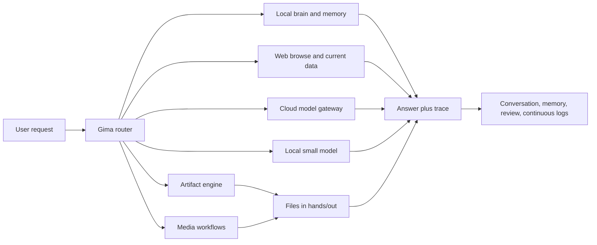
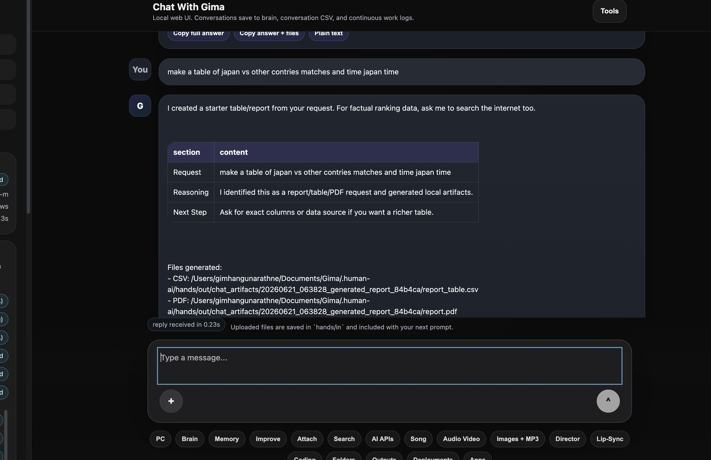
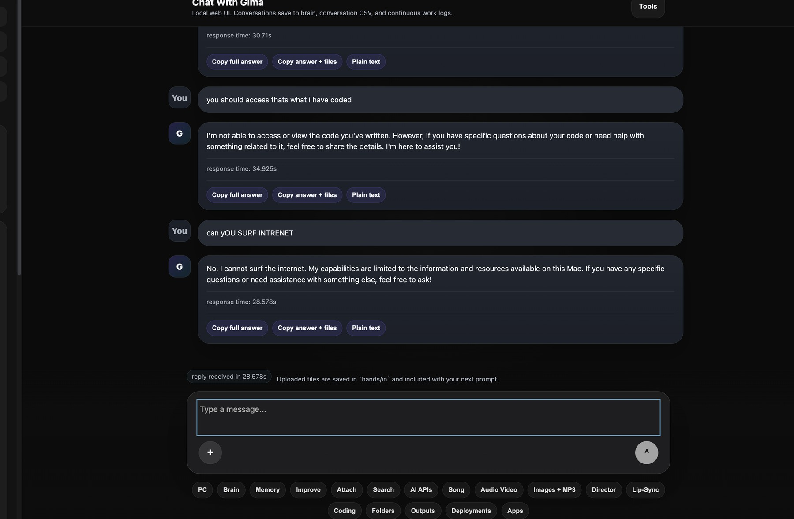
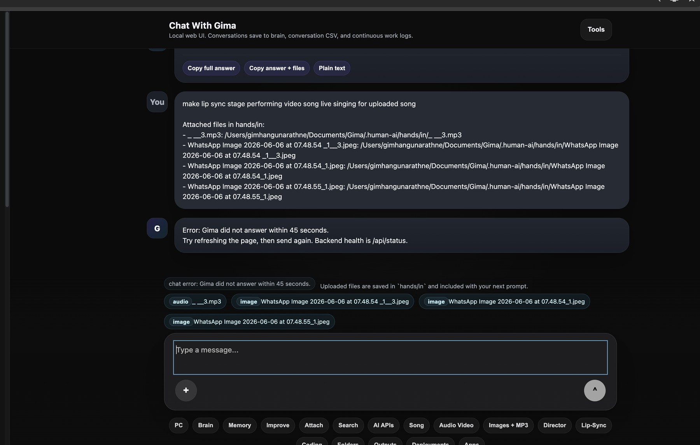
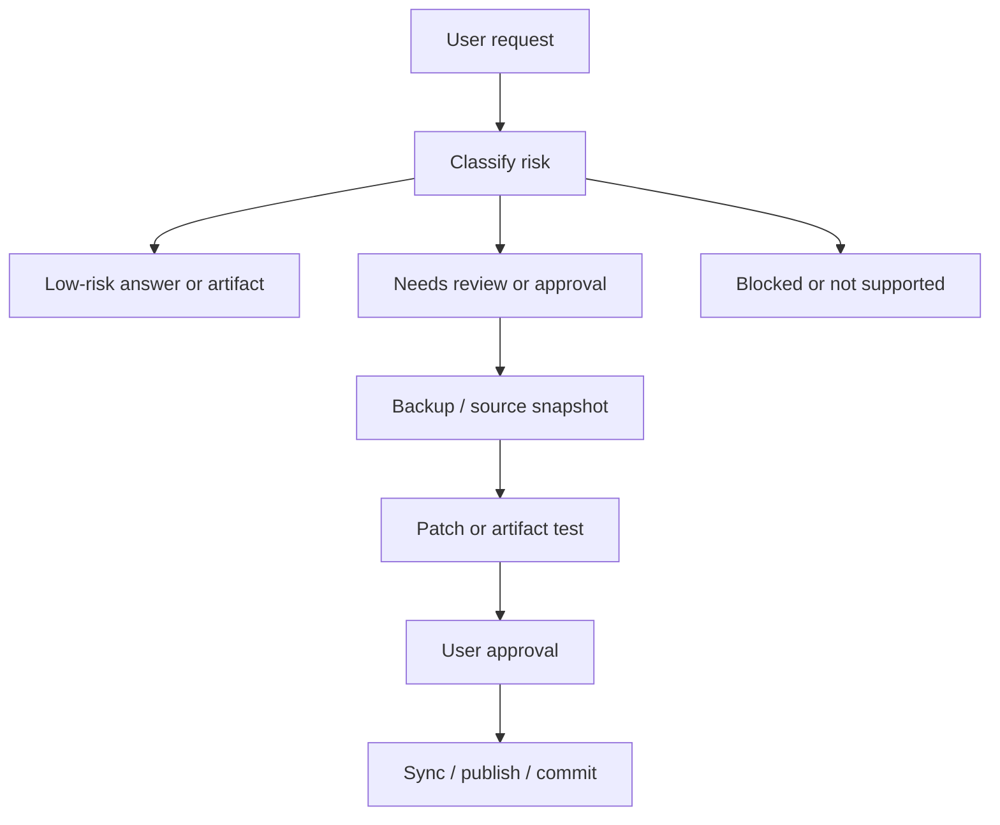

# Gima Whitepaper


**A local-first AI workspace for memory, research, artifact creation, media workflows, and safe self-improvement**
Version 2.1 | 4 July 2026
Author: Gimhan Gunarathne
Project: Gima / Human AI Local
Repository: https://github.com/data-G/Gima

---

## Executive Summary

Gima is a local-first AI workspace built to make a personal AI useful, inspectable, and controllable on everyday hardware. It combines local memory, a browser-based chat interface, optional cloud model gateways, source-backed browsing, artifact generation, media planning, and review-gated self-improvement.

Gima is not designed as an uncontrolled autonomous system. It is designed as a practical workspace where the user can see what was used, what was created, where files are stored, which provider answered, and what still needs review.

### Core Proposition

| Principle | Meaning |
|---|---|
| Local-first memory | Conversations, knowledge, outputs, reviews, and logs live in the local Gima workspace. |
| Hybrid intelligence | Gima uses local models, deterministic routes, browsing, and optional cloud providers according to task type. |
| Real artifacts | Reports, CSV files, Markdown, PDFs, JPG previews, workbooks, and media plans are written to visible folders. |
| Source-backed current facts | Weather, web research, and current information use browsing or domain APIs instead of memory guesses. |
| Review-gated improvement | Gima can plan and test code changes, but live sync requires explicit user control. |

---

## 1. The Problem

Many AI assistants are powerful but opaque. Users often cannot easily inspect:

- where memory is stored;
- whether a current fact was actually checked;
- which model or provider answered;
- whether a generated file truly exists;
- what data left the machine;
- whether an action was safe or approved;
- how the system changes over time.

Gima addresses this by treating AI as a workspace, not only a chat box. The system stores memory and outputs locally, exposes provider status, saves artifacts in `hands/out`, and separates ordinary learning from code modification.

---

## 2. Product Vision

Gima should become a personal AI operating workspace that can:

- answer from local memory with traceable context;
- browse the public web when current information is needed;
- create business-grade reports, costing tables, and source registers;
- generate files in Excel, CSV, Markdown, PDF, and JPG formats;
- use linked models through OpenRouter, OpenAI, Gemini, Anthropic, and other providers;
- plan media workflows with camera angles, scene beats, human emotion, and audio timing;
- help with coding, GitHub sync, and deployment preparation;
- maintain daily improvement logs and capability dashboards;
- help prepare legal earning assets such as proposals, portfolio posts, and whitepapers.

The goal is not to pretend that one small local model can do everything. The goal is to route each request to the most reliable mechanism.

---

## 3. System Architecture

Gima is organized around a routing layer that decides how to answer a user request.



### Architecture Layers

| Layer | Responsibility | Implementation |
|---|---|---|
| Interface | Chat, uploads, dashboards, tools | `human_ai/web_ui.py`, `Start Gima.command` |
| CLI | Start, status, learning, scheduling, providers | `human_ai/gima.py` |
| Memory | Records, reviews, conversations, brain index | `.human-ai/`, `memory.py`, `brain_index.py` |
| Routing | Choose brain, browse, artifact, media, cloud, or local model | `web_ui.py`, `agent.py`, `artifacts.py` |
| Browsing | Public search, direct URL import, weather | `WebImporter`, DuckDuckGo Lite, Open-Meteo |
| Cloud gateway | Optional stronger model access | OpenAI, Gemini, Anthropic, OpenRouter |
| Artifacts | Tables, reports, source files, media plans | `artifacts.py`, scripts, `hands/out` |
| Safety | Secrets, permissions, approvals, quotas, protected paths | `secrets.py`, `permissions.py`, `quota.py` |
| Improvement | Backup, plan, patch, test, GitHub sync | `self_update.py`, `vibe_code.py`, scripts |

---

## 4. Product Screenshots

The screenshots below show the current local Gima interface and the direction of the product experience: chat-first interaction, tool buttons, visible memory/provider status, generated artifacts, and early media workflow controls.

### Screenshot 1 - Artifact and Report Workflow



This view shows Gima identifying a report/table request and creating local artifacts such as CSV and PDF outputs.

### Screenshot 2 - Chat Workspace and Tools



This view shows the chat workspace, copy/export controls, tool shortcuts, and the direction toward provider-aware model routing.

### Screenshot 3 - Media Workflow Controls



This view shows the media workflow area, including image-plus-audio inputs and dedicated buttons for audio-video, director, and lip-sync workflows.

---

## 5. Memory and Filesystem Model

Gima's durable state is stored under the local `.human-ai` workspace.

| Path | Purpose |
|---|---|
| `.human-ai/brain/` | Human-readable learned knowledge |
| `.human-ai/brain/brain.csv` | Consolidated retrieval index |
| `.human-ai/csv/` | Conversations, reviews, approvals, audits |
| `.human-ai/hands/in/` | Files uploaded through the UI |
| `.human-ai/hands/out/` | Generated reports, videos, workbooks, manifests |
| `.human-ai/continuous/` | Daily plans, work traces, snapshots |
| `.human-ai/secrets.env` | Private local API keys, excluded from Git |

This makes Gima auditable. A user can inspect the memory, output files, and logs without needing a proprietary cloud dashboard.

---

## 6. Model and Provider Strategy

Gima uses a hybrid model approach.

### Local Model

The local model is used for fast private fallback and lightweight chat. It is intentionally small enough to run on the available hardware.

### Cloud Models

Cloud providers are optional and used when stronger reasoning or model diversity is needed. Gima supports provider adapters for OpenAI, Gemini, Anthropic, xAI, DeepSeek, and OpenRouter.

### OpenRouter and MiniMax

OpenRouter is treated as a model gateway. Gima stores `OPENROUTER_API_KEY` locally and uses an OpenAI-compatible chat-completions interface.

Example model configuration:

```json
{
  "teacher_models": {
    "openrouter_model": "openai/gpt-5.5"
  }
}
```

MiniMax can be tested through OpenRouter by changing the model ID:

```json
{
  "teacher_models": {
    "openrouter_model": "minimax/minimax-m3"
  }
}
```

Recommended next improvements:

| Improvement | Value |
|---|---|
| Streaming responses | Faster perceived answers in the UI |
| Usage logging | Track token, reasoning-token, latency, and cost metadata |
| Model picker | Let the user choose OpenRouter models from Gima settings |
| Provider benchmark | Compare quality, speed, cost, and failure rate |

---

## 7. Browsing and Current Information

Gima supports explicit browsing routes:

- `browse the web for ...`
- `search the web for ...`
- `look up ...`
- `check online ...`
- `browse https://example.com/page`
- current weather requests.

Current weather now uses Open-Meteo instead of weak generic search scraping. For example:

> Gima, search the web for current weather in Osaka.

returns a current weather summary and creates:

- `current_weather.csv`
- `current_weather.md`
- source URL metadata

This is a key reliability rule:

> Current facts should use current sources, not stale memory or model guesses.

---

## 8. Artifact Generation

Gima is designed to produce real files.

| Request | Output |
|---|---|
| Catering costing | Excel, JPG, PDF, assumptions, source register |
| Current weather | CSV, Markdown, source URL |
| Web research | Source CSV, Markdown notes |
| Direct URL browse | Page summary CSV, Markdown |
| Fastest cars | CSV, PDF, Markdown, manifest |
| Uploaded files | Indexed records and searchable memory |

Gima should not create placeholder tables just to appear helpful. If a dataset is missing, it should ask for the source or browse for one.

---

## 9. Media Workflows

Gima has early-stage media capabilities for:

- song sketching;
- image-plus-audio video drafts;
- music video director plans;
- camera-angle and scene planning;
- emotion maps;
- pitch and beat analysis;
- lip-sync planning;
- optional neural backend checks.

The system separates local composition from true neural generation.

| Label | Meaning |
|---|---|
| Local render | FFmpeg or deterministic media composition |
| AI-directed plan | Storyboard, prompts, camera moves, emotion timeline |
| Neural render | Output from a configured AI media backend |
| Not ready | Backend, model, consent, or dependency missing |

This protects users from overclaiming. A local draft can be useful, but it should not be labeled as true AI-generated video frames unless a real video model produced it.

---

## 10. Safety and Governance

Gima uses application controls instead of relying only on prompts.



### Safety Controls

| Risk | Control |
|---|---|
| API key exposure | Masked UI, `.human-ai/secrets.env`, Git ignore |
| Unsafe browsing | Public HTTP(S) only, private/local hosts blocked |
| Fake current facts | Browse/API route before cloud or local model |
| Unsafe file access | Downloads limited to Gima storage roots |
| Tool misuse | Allowlisted commands and scoped permissions |
| Bad knowledge | Review states and parent approval |
| Unsafe self-editing | Backup, isolated work, tests, explicit sync approval |
| Media misuse | Consent gates and provenance manifests |

---

## 11. Daily Improvement Loop

Gima's improvement loop should produce a visible daily record across six tracks:

1. Reliability: status, startup, hidden errors.
2. Knowledge: source-backed learning and brain rebuild.
3. Artifact: one real output bundle.
4. Legal earning: a truthful business or portfolio asset.
5. Evaluation: focused tests or live smoke check.
6. Safe self-improvement: backup, diff, tests, approval.

This turns "self-improvement" into engineering discipline instead of uncontrolled autonomy.

---

## 12. Legal Earning and AI Influencer Direction

Gima can help the user earn legally by preparing assets, not by acting without approval.

Allowed support:

- whitepapers;
- proposals;
- LinkedIn drafts;
- portfolio demos;
- costing estimates;
- job application preparation;
- hardware upgrade comparisons.

Requires explicit user approval:

- posting publicly;
- contacting customers;
- applying for jobs;
- spending money;
- buying hardware;
- pushing code to GitHub.

---

## 13. Roadmap

| Phase | Priority | Outcome |
|---|---:|---|
| Reliability | P0 | Stable startup, status, provider health, clean restarts |
| Research | P0 | Source-ranked browsing, citations, research PDFs |
| Artifacts | P0 | More Excel/PDF/JPG workflows with manifests |
| Provider Layer | P1 | OpenRouter model picker, MiniMax tests, usage logging |
| Media | P1 | True video backend integration and quality evaluation |
| Agents | P2 | Resumable plan-act-observe workbench |
| Public Release | P2 | License, GitHub release, demo video, LinkedIn launch |

---

## 14. LinkedIn Summary

I am building **Gima**, a local-first AI workspace that combines private memory, web browsing, real artifact generation, optional cloud models, media planning, and safe self-improvement.

The idea is simple: a useful personal AI should not only chat. It should remember locally, browse when facts are current, create real files, show sources, protect secrets, and improve through tests and user approval.

Gima is still experimental, but it is becoming a practical AI workspace for research, reports, media planning, coding, and daily improvement.

---

## 15. Conclusion

Gima's value is not one model. Its value is the system around the model:

- local memory;
- source-backed browsing;
- deterministic artifact routes;
- optional cloud intelligence;
- visible files;
- safety controls;
- tests;
- user approval.

That is the foundation for a personal AI that can become more useful without becoming opaque or uncontrolled.

---

## References

1. Ink & Switch, "Local-first software." https://www.inkandswitch.com/essay/local-first/
2. Lewis et al., "Retrieval-Augmented Generation for Knowledge-Intensive NLP Tasks." https://arxiv.org/abs/2005.11401
3. OWASP GenAI Security Project. https://genai.owasp.org/
4. NIST AI Risk Management Framework. https://www.nist.gov/itl/ai-risk-management-framework
5. Open-Meteo API. https://open-meteo.com/
6. OpenRouter Documentation. https://openrouter.ai/docs
7. Gima source repository. https://github.com/data-G/Gima
